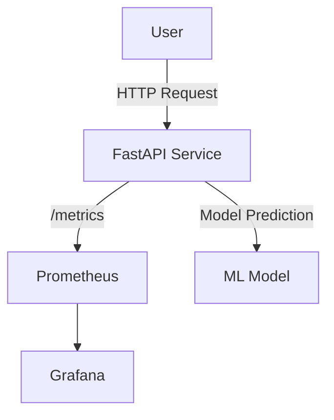

# RecrutaIA Rank - Datathon MLOps RH IA

## Overview

This project is an end-to-end MLOps pipeline for ranking candidates for job positions using machine learning and modern MLOps practices. It is designed for the Datathon MLOps RH IA challenge and demonstrates a production-ready approach for deploying, monitoring, and evaluating ranking models.

## Main Features

- **FastAPI**: REST API for serving candidate ranking predictions.
- **Machine Learning Pipeline**: Data preprocessing, feature engineering, model training, and prediction using LightGBM and scikit-learn.
- **Monitoring**: Integrated Prometheus and Grafana for real-time API and model monitoring (request count, latency, custom metrics).
- **Dockerized**: All services (API, Prometheus, Grafana) run in containers for easy deployment.
- **Notebooks**: For data exploration, embedding checks, and mock data testing.
- **Evaluation**: Scripts and tools for robust model evaluation (NDCG, MAP, group analysis).
- **Reproducibility**: All dependencies are pinned and tracked for consistent environments.

## Project Structure

```
.
├── app/                # Core application logic (pipeline, stages, prediction, evaluation)
├── data/               # Data files (processed, embeddings, model input, etc.)
├── models/             # Trained models and pipelines
├── notebooks/          # Jupyter notebooks uised for exploring and testing
├── services/
│   ├── api/            # FastAPI service and routes
│   └── monitoring/     # Prometheus / Grafana for monitorin g
├── docker-compose.yml  # Services w/ docker
├── requirements-dev.txt    
```

## 🚀 Quick Start: Docker (Recommended)

**Just want to see it working? One command gets you a complete ML system:**

```bash
# Clone and start everything
git clone https://github.com/matheusbuniotto/datathon-mlops-rh-ia.git
cd datathon-mlops-rh-ia
docker-compose up --build
```

**🎯 What you get instantly:**
- ✅ **ML API** with trained models → `http://localhost:8000`
- ✅ **Grafana Dashboard** (no login) → `http://localhost:3000`  
- ✅ **Prometheus Metrics** → `http://localhost:9090`
- ✅ **Zero configuration** - everything works out of the box

**🧪 Test the API:**
```bash
# Health check
curl http://localhost:8000/health

# Get available job positions 
curl "http://localhost:8000/v1/list-vagas"

# Get ranked candidate recommendations
curl "http://localhost:8000/v1/recommend_ranked?vaga_id=1650&top_n=5"
```

**📊 Monitor in Grafana:**
- Request rates, response times, ML predictions
- Data drift detection and model performance
- Real-time dashboards with business metrics

## 🛠️ Development: Full ML Pipeline

**Want to train your own models or work with real data? Here's the complete workflow:**

### 1. Environment Setup
```bash
# Install dependencies (recommended: use uv)
uv sync

# Install package in development mode  
uv pip install -e .
```

### 2. Interactive Setup with Data Options
```bash
# Interactive setup - choose sample or real data
uv run scripts/quick_start.py

# Follow prompts to select:
# 1. Sample data (100 records) - Fast demo 
# 2. Real data (auto-download) - Full performance
```

### 3. Manual Pipeline & Training
```bash
# Download real production data (if needed)
uv run scripts/download_data.py

# Run complete data pipeline  
uv run app/pipeline_run_all.py

# Train model with hyperparameter tuning
uv run app/model/train_ranker_tuning.py dev

# Evaluate model performance
uv run app/model/evaluate_ranker.py

# Run local API
uvicorn services.api.main:app --host 0.0.0.0 --port 8000 --reload
```

### 4. Development Tools
```bash
# Run tests
pytest

# Code quality
uv run ruff check .
uv run ruff format .
```

### 📊 Data Information

**Sample Data (included in repo):**
- `sample_applicants.json` (50 candidates, 212KB)
- `sample_vagas.json` (20 job positions, 44KB)  
- `sample_prospects.json` (30 prospects, 36KB)

**Production Data (auto-downloaded from GitHub Releases):**
- `applicants.json` (194MB) - Full candidate database
- `vagas.json` (37MB) - Complete job positions  
- `prospects.json` (21MB) - All prospect data

## Key Endpoints

- `GET /health`: Service health check
- `GET /v1/recommend_ranked?vaga_id={id}&top_n={n}`: Get ranked candidate recommendations for a specific job
- `GET /v1/list-vagas`: Returns all available vaga IDs that can be used with the recommend endpoint
- `GET /metrics`: Prometheus metrics endpoint

## Architecture Overview

The system follows a staged ML pipeline architecture:

### Core Components

1. **Data Pipeline (`app/pipeline.py`)**: Orchestrates the complete data processing flow
   - Raw JSON data → Parquet conversion
   - SQL-based data merging via DuckDB
   - Embedding generation using sentence-transformers
   - Ranking dataset preparation

2. **ML Pipeline Stages (`app/stages/`)**:
   - `embeddings_stage.py`: Generates semantic embeddings for job descriptions and candidate profiles
   - `ranking_preparation_stage.py`: Creates training data for ranking model with relevance targets
   - `feature_engineering_stage.py`: Feature engineering and preprocessing
   - `data_split_stage.py`: Data splitting for training/validation/test

3. **Model Training (`app/model/`)**:
   - `train_ranker.py`: LightGBM ranking model training
   - `train_ranker_tuning.py`: Hyperparameter optimization with Optuna
   - `evaluate_ranker.py`: Model evaluation with ranking metrics (NDCG, MAP)

4. **API Service (`services/api/`)**:
   - FastAPI-based REST API
   - Real-time candidate ranking predictions
   - Prometheus metrics integration
   - Health monitoring

5. **Monitoring Stack (`services/monitoring/`)**:
   - Prometheus for metrics collection
   - Grafana for visualization and dashboards
   - Custom business metrics and data drift monitoring

### Data Flow

```
Raw Data (JSON) → Data Pipeline → Embeddings → Feature Engineering → Model Training → API Deployment
                                     ↓
                              Monitoring & Evaluation
```

### Key Data Artifacts

- `data/processed/merged.parquet`: Unified recruitment data
- `data/embeddings/combined_embeddings.parquet`: Semantic embeddings for all entities
- `data/model_input/`: Preprocessed features ready for model training
- `models/lgbm_ranker.pkl`: Trained LightGBM ranking model

## Monitoring Metrics

- API request count and latency (by endpoint/method)
- Custom business metrics and data drift monitoring
- Real-time model performance tracking

## Notebooks
!! CAUTION !! These are used for exploration porpose only.
- `notebooks/embeding_check.ipynb`: Embedding and feature pipeline checks
- `notebooks/mock_data_test.ipynb`: Mock data and prediction pipeline tests

## Requirements

- Docker & Docker Compose
- Python 3.11+ (for local development)
- See `requirements-dev.txt` for dependencies

## Technical Details

- **ML Framework**: LightGBM for ranking with group-based learning-to-rank
- **Embeddings**: Generated using sentence-transformers (multilingual models)
- **Data Processing**: DuckDB for efficient SQL operations and data processing
- **API Framework**: FastAPI with Prometheus metrics integration
- **Containerization**: All services run in Docker containers for consistent deployment
- **Model Evaluation**: Ranking-specific metrics (NDCG, MAP)
- **Monitoring**: Real-time data drift monitoring capabilities

## Development Tips

- Use `uv` for faster dependency management when available
- The notebooks in `notebooks/` are for exploration and may need cleanup  
- Model artifacts are saved in both `app/model/` and `models/` directories
- All major pipeline stages have corresponding test files
- Ruff is configured to exclude Jupyter notebooks from linting

## Architecture



## How to Use Docker

```bash
# Build all services 
docker-compose build

# Start all services
docker-compose up

```

## Example API Calls

```bash
# Get list of all available vaga IDs
curl "http://localhost:8000/v1/list-vagas"

# Get ranked candidate recommendations for specific vagas
curl "http://localhost:8000/v1/recommend_ranked?vaga_id=1650&top_n=5"
curl "http://localhost:8000/v1/recommend_ranked?vaga_id=6647&top_n=10"
```

