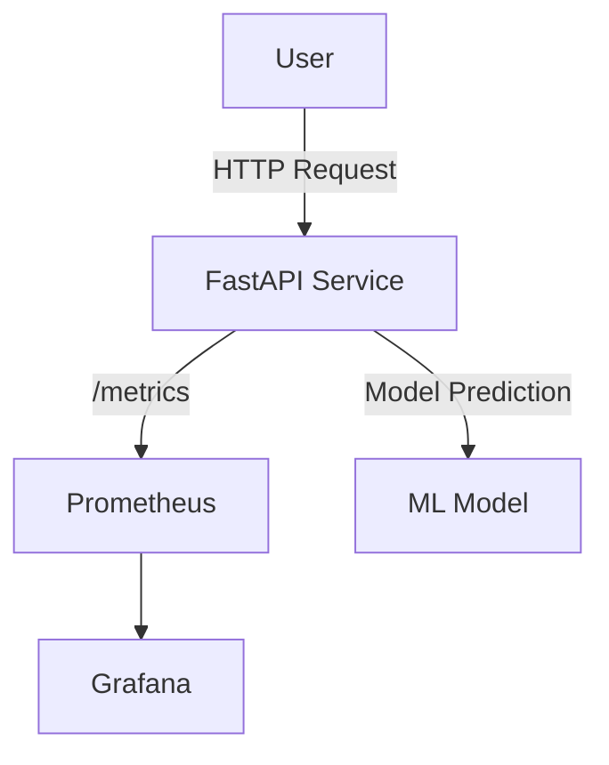

# RecrutaIA Rank - Datathon MLOps RH IA

## Overview

This project is an end-to-end MLOps pipeline for ranking candidates for job positions using machine learning and modern MLOps practices. It is designed for the Datathon MLOps RH IA challenge and demonstrates a production-ready approach for deploying, monitoring, and evaluating ranking models.

## Main Features

- **FastAPI**: REST API for serving candidate ranking predictions.
- **Machine Learning Pipeline**: Data preprocessing, feature engineering, model training, and prediction using LightGBM and scikit-learn.
- **Monitoring**: Integrated Prometheus and Grafana for real-time API and model monitoring (request count, latency, custom metrics).
- **Dockerized**: All services (API, Prometheus, Grafana) run in containers for easy deployment.
- **Notebooks**: For data exploration, embedding checks, and mock data testing.
- **Evaluation**: Scripts and tools for robust model evaluation (NDCG, MAP, group analysis).
- **Reproducibility**: All dependencies are pinned and tracked for consistent environments.

## Project Structure

```
.
├── app/                # Core application logic (pipeline, stages, prediction, evaluation)
├── data/               # Data files (processed, embeddings, model input, etc.)
├── models/             # Trained models and pipelines
├── notebooks/          # Jupyter notebooks uised for exploring and testing
├── services/
│   ├── api/            # FastAPI service and routes
│   └── monitoring/     # Prometheus / Grafana for monitorin g
├── docker-compose.yml  # Services w/ docker
├── requirements-dev.txt    
```

## How to Run

1. **Build and Start All Services**  
   ```bash
   docker-compose up --build
   ```

2. **API**  
   - Accessible at: `http://localhost:8000`
   - Health check: `GET /health`
   - Prediction: `/v1/recommend_ranked` + parameter for vaga_id (meaning job position id)

3. **Monitoring**  
   - Prometheus: `http://localhost:9090` (without login)
   - Grafana: `http://localhost:3000` (default user: admin / admin)

4. **Model Training & Evaluation**  
   - Run pipelines and evaluation scripts in the `app/` folder or via notebooks.
   * Note: notebooks are messy and need some adjusment for better readability.

## Key Endpoints

- `/health`: API health check
- `/v1/recommend_ranked`: Ranked candidate recommendations for a given job role.
- TO DO /v1/list_jobs: Will return a list of possible job ids to use

## Monitoring Metrics

- API request count and latency (by endpoint/method)
- Custom business metrics (can be extended)

## Notebooks
!! CAUTION !! These are used for exploration porpose only.
- `notebooks/embeding_check.ipynb`: Embedding and feature pipeline checks
- `notebooks/mock_data_test.ipynb`: Mock data and prediction pipeline tests

## Requirements

- Docker & Docker Compose
- Python 3.11+ (for local development)
- See `requirements-dev.txt` for dependencies


### 

Running

> uv run app/model/train_ranker_tuning.py dev

## Architecture



## How to Use Docker

```bash
# Build all services 
docker-compose build

# Start all services
docker-compose up

```

## Example API Call

```bash
curl "http://localhost:8000/v1/recommend_ranked`"
```

